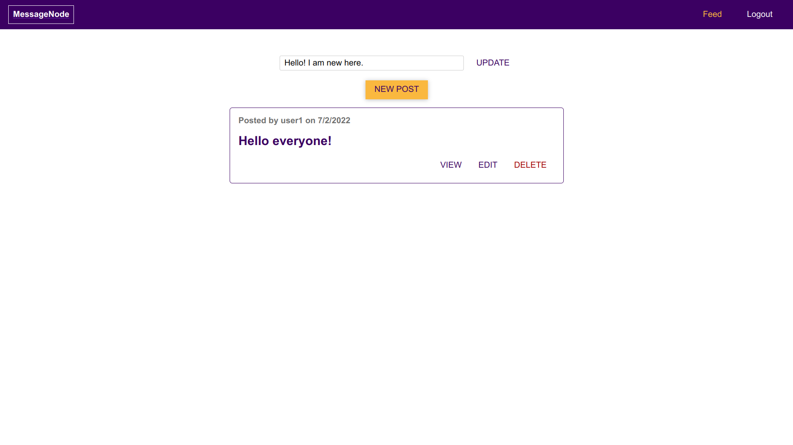
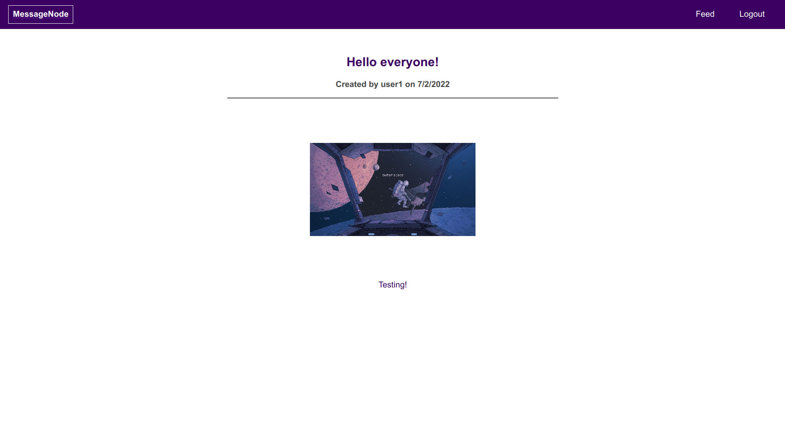

# Social-Network-Web-App

## A social-networking web-app made using ReactJS , NodeJS, ExpressJS, Socket.IO, MongoDB and REST API

Login credentials :

1. Email : user1@gmail.com , Password : user1
2. Email : user2@gmail.com , Password : user2

[][youtube]

### You can watch the project in working **[Here.][youtube]** 

[youtube]: https://youtu.be/CSiiK-mMusM

[][youtube]

[][youtube]

### You can watch the project in working **[Here.][youtube]** 

[youtube]: https://youtu.be/K8QxEOz-Jtw
